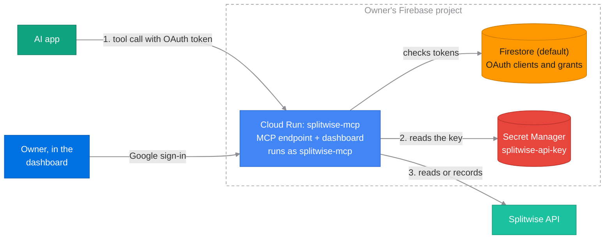

# Private AI connector for Splitwise

Ask Gemini, Claude or ChatGPT about your shared expenses, and tell it about new
ones, from a private connector that runs in your own Firebase project.

> "I paid 84.60 for dinner with Alex and Sam, split it evenly."
>
> "How much do I owe across all my groups?"
>
> "What did our Montreal trip cost me, not counting payments?"

- **Yours alone.** Each person deploys their own copy into their own Firebase
  project, with their own Splitwise API key. Your data goes from Splitwise to
  your project to the AI app you connect, and nowhere else: there is no shared
  server, and the developer never sees it.
- **Reads and records.** The AI can read your groups, friends, balances and
  expenses, and add, change, delete or settle up expenses. Deleted expenses
  can be restored and changes reverted, and it can't touch your groups,
  friends or profile.
- **One page to manage it.** The dashboard holds your Splitwise API key, shows
  whether Splitwise is answering, and lists the AI apps you've connected.

This project is unofficial and not affiliated with Splitwise. It uses the
[Splitwise Self-Serve API](https://dev.splitwise.com/), which is meant for
personal, non-commercial use and can change without notice. Splitwise is a
trademark of Splitwise, Inc.

## Why this exists

I wanted to record a shared expense by just telling my AI app, from my phone,
right after paying. Most open-source Splitwise MCP servers I found run on your
own computer with the API key in a config file, which doesn't reach the AI
apps on the web or on a phone. So I made this, for anyone to run their own
copy.

## How to use

### 1. Create a Firebase project

[Create a new project](https://console.firebase.google.com/) and upgrade it to
the Blaze plan. For one person, it stays within the no-cost tier.

### 2. Run the setup

Click this button. It opens Google Cloud Shell with a setup guide on the right.

[](https://shell.cloud.google.com/cloudshell/editor?cloudshell_git_repo=https://github.com/induction-axiom/ai-connector-for-splitwise&cloudshell_git_branch=stable&cloudshell_tutorial=docs/cloudshell-tutorial.md&show=terminal)

When Cloud Shell asks, tick **Trust repo**. Then follow the guide. It takes
about 5 minutes and ends with your dashboard link. Bookmark it.

If the guide doesn't open, the download from GitHub was interrupted. In the
terminal, press ↑ then Enter to try again.

### 3. Add your Splitwise API key

Open the dashboard and sign in with Google. It walks you through creating a
key on your [Splitwise apps page](https://secure.splitwise.com/apps): register
an app with any name, then choose **Create API key**. Paste the key into the
dashboard. It is checked with Splitwise before it is saved.

Creating a key means accepting Splitwise's API terms of use, on the same
[developer page](https://dev.splitwise.com/).

### 4. Connect your AI app

In the dashboard: **AI apps** → your app → **How to connect**.

When the AI app sends you to approve the connection, only allow it if you
just chose Connect in that app yourself. Someone else can send you a link
that looks the same.

## Later

- **Lost the dashboard link?** Ask your AI app for it.
- **Updating.** The dashboard shows a banner when a new version is out. Click
  **How to update**. Your API key and connections stay.
- **Removing it.** Disconnect your AI apps and remove the key in the
  dashboard, then delete the Firebase project (**Project settings → General →
  Delete project**). Also delete the app on your
  [Splitwise apps page](https://secure.splitwise.com/apps), which ends the key
  for good.

## How your data is handled

Your connector asks Splitwise each time your AI app calls a tool and passes
the answer on. It doesn't save your expenses anywhere. Your project keeps only
the API key, in Secret Manager, which only the connector can read; the AI app
sign-ins you approved; and the last error Splitwise gave, for the dashboard.

The AI gets six read tools (`get_status`, `list_groups`, `list_friends`,
`list_expenses`, `get_expense`, `list_categories`) and six that record
(`create_expense`, `record_payment`, `update_expense`, `delete_expense`,
`restore_expense`, `add_comment`). What it records, everyone who shares that
expense sees, just as if you had entered it in Splitwise. Before adding an
expense, the connector looks for one with the same cost from the last three
days, and asks you to confirm if it finds one. Your API key and pictures are
never shared with the AI.

## Development

```text
firebase/
  mcp/        MCP server, Splitwise client, tools, dashboard
  scripts/    bootstrap.sh, manage.py (bootstrap, deploy, doctor, urls)
tests_mcp/  tests_deployment/  tests_ui/
docs/cloudshell-tutorial.md     The Cloud Shell guide
```

Deploy after a change, then check the access boundaries:

```sh
python3 firebase/scripts/manage.py deploy --project YOUR_PROJECT_ID
python3 firebase/scripts/manage.py doctor --project YOUR_PROJECT_ID
```

Run the tests, with the packages in `firebase/mcp/requirements.txt` installed:

```sh
python3 -m unittest discover -s tests_mcp -t tests_mcp
python3 -m unittest discover -s tests_deployment -t tests_deployment
(cd tests_ui && npm ci && npx playwright test)
```

`tests_mcp/splitwise_api.json` lists the parameters Splitwise documents for
each endpoint this connector calls; a test checks every request against it.

### Architecture



A tool call, step by step:

1. The AI app calls `/mcp` on Cloud Run with an OAuth token the owner approved
   once with Google.
2. Cloud Run reads the API key from Secret Manager. Only the `splitwise-mcp`
   identity can read or change it.
3. It calls Splitwise and returns the answer, without pictures or group invite
   links.

Resource names are fixed in `firebase/scripts/configuration.py`. Nothing is
saved locally: `manage.py` finds the deployed `splitwise-mcp` service and
reads its region, owner and Firebase config from it.

This project started as a copy of
[ai-connector-for-your-wealthsimple](https://github.com/induction-axiom/ai-connector-for-your-wealthsimple),
which shares its sign-in, dashboard and setup.

## License

Copyright (C) 2026 Jong Luo. Licensed under the GNU Affero General Public
License v3.0 only (AGPL-3.0-only). See [LICENSE](LICENSE).
