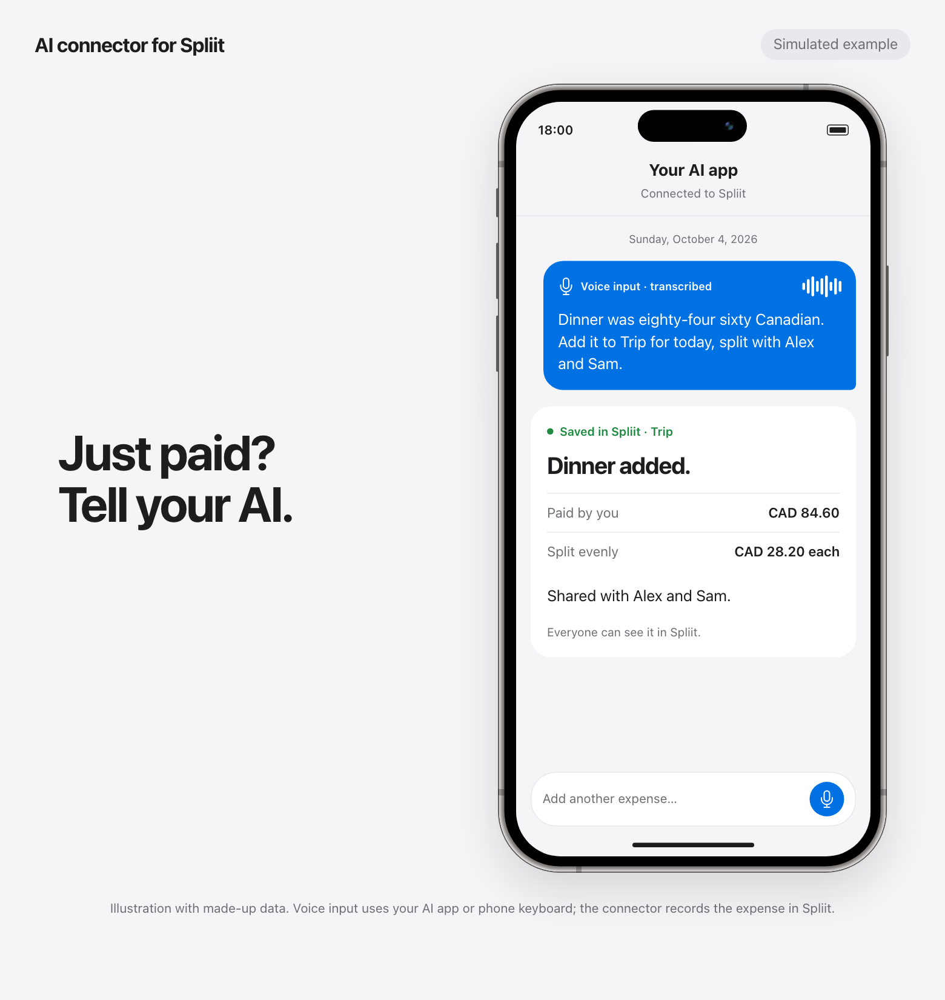
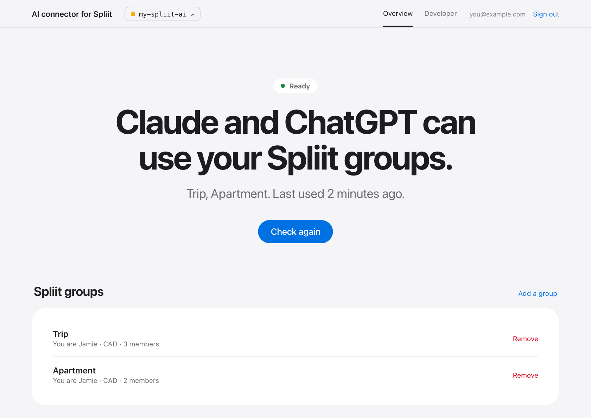
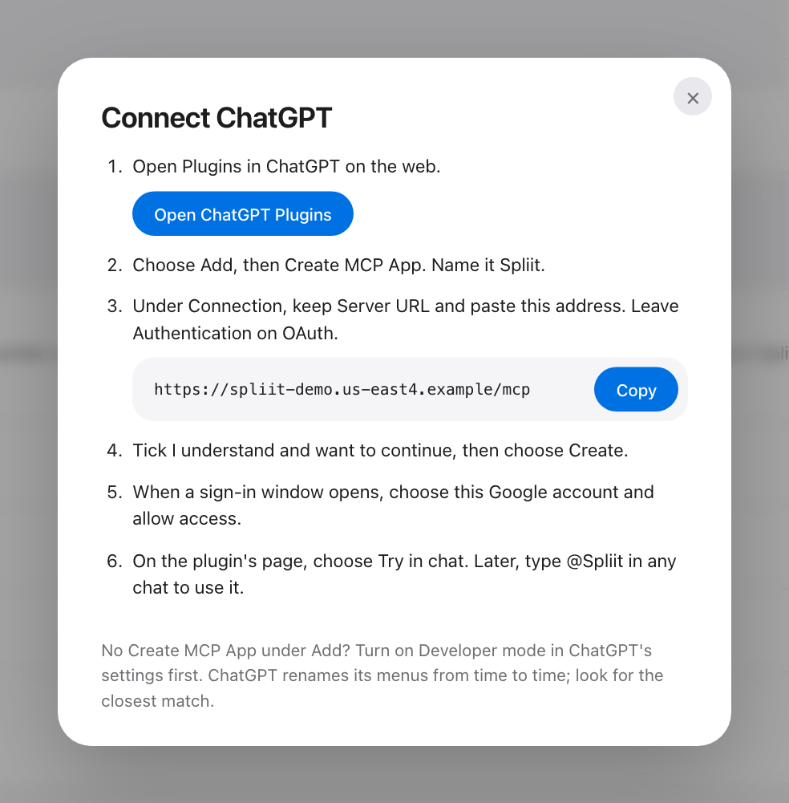
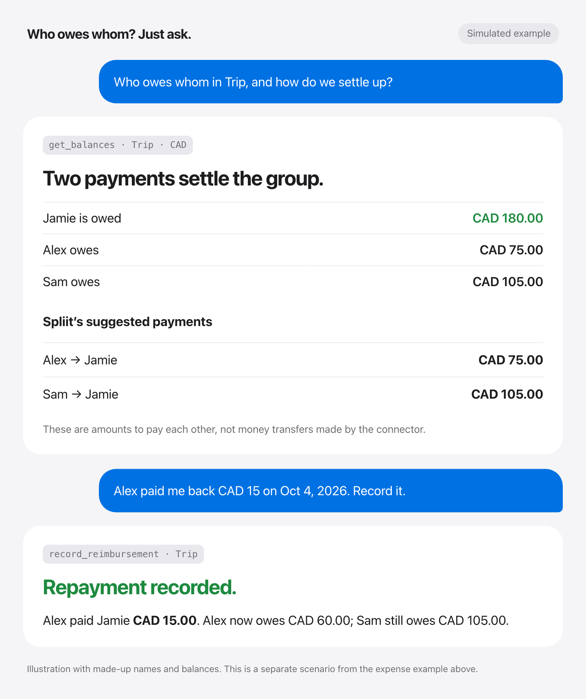
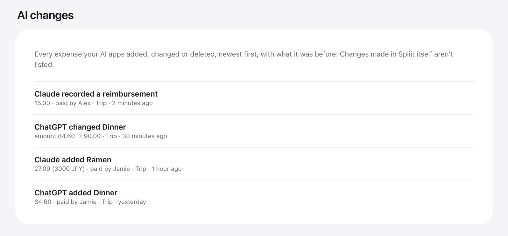
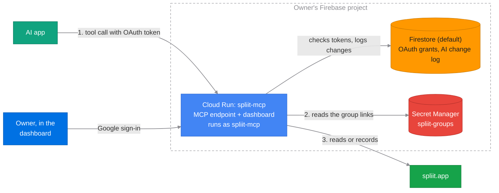

# Private AI connector for Spliit

Ask Gemini, Claude or ChatGPT about your shared expenses in
[Spliit](https://spliit.app), and tell it about new ones, from a private
connector that runs in your own Firebase project.

Just paid? Dictate a message to your AI app on your phone, and let it record
the shared expense in Spliit:

<picture>
  <source media="(prefers-color-scheme: dark)" srcset="docs/images/example-record-dark.png">
  
</picture>

All images use made-up data. Conversations are illustrations; the dashboard
screenshots show the actual interface.

- **Yours alone.** Each person deploys their own copy into their own Firebase
  project, with their own group links. Your data goes from Spliit to your
  project to the AI app you connect, and nowhere else: there is no shared
  server, and the developer never sees it.
- **Reads and records.** The AI can read your groups' members, balances and
  expenses, and add expenses, record reimbursements and change expenses. It
  can delete only the expenses it added, and can't change groups and members.
  Every change it makes is kept with what the expense was before.
- **One page to manage it.** The dashboard holds your group links, shows
  whether Spliit is answering, lists the AI apps you've connected, and lists
  every change they made.

<picture>
  <source media="(prefers-color-scheme: dark)" srcset="docs/images/overview-dark.png">
  
</picture>

This project is unofficial and not affiliated with Spliit. It uses the API
Spliit's own web app uses, which is not published and can change without
notice. Spliit is free and runs on donations; if it helps you, consider
[supporting it](https://opencollective.com/spliit).

## Why this exists

I wanted to record a shared expense by just telling my AI app, from my phone,
right after paying, in a free app my friends can use without an account.
Spliit fits, and it's open source. So I made this connector, for anyone to run
their own copy.

## How to use

### 1. Create a Firebase project

[Create a new project](https://console.firebase.google.com/) and upgrade it to
the Blaze plan. For one person, it stays within the no-cost tier.

### 2. Run the setup

Click this button. It opens Google Cloud Shell with a setup guide on the right.

[](https://shell.cloud.google.com/cloudshell/editor?cloudshell_git_repo=https://github.com/induction-axiom/ai-connector-for-spliit&cloudshell_git_branch=stable&cloudshell_tutorial=docs/cloudshell-tutorial.md&show=terminal)

When Cloud Shell asks, tick **Trust repo**. Then follow the guide. It takes
a few minutes and ends with your dashboard link. Bookmark it.

If the guide doesn't open, the download from GitHub was interrupted. In the
terminal, press ↑ then Enter to try again.

### 3. Add your Spliit groups

Open the dashboard and sign in with Google. Paste a group's link from Spliit,
then choose which member you are. Add as many groups as you like. If you
rename a group in Spliit, the connector picks up the new name.

A group's link is its key: anyone who has it can read and change the group,
which is how you share it with friends. The dashboard keeps it in your
project's Secret Manager, and your AI apps never see it.

### 4. Connect your AI app

In the dashboard: **AI apps** → your app → **How to connect**.

<picture>
  <source media="(prefers-color-scheme: dark)" srcset="docs/images/connect-chatgpt-dark.png">
  
</picture>

When the AI app sends you to approve the connection, only allow it if you
just chose Connect in that app yourself. Someone else can send you a link
that looks the same.

Then ask who owes whom, or record a repayment you've received:

<picture>
  <source media="(prefers-color-scheme: dark)" srcset="docs/images/example-settle-dark.png">
  
</picture>

## Later

- **Lost the dashboard link?** Ask your AI app for it.
- **Updating.** The dashboard shows a banner when a new version is out. Click
  **How to update**. Your groups, connections and change log stay.
- **Removing it.** Disconnect your AI apps and remove your groups in the
  dashboard, then delete the Firebase project (**Project settings → General →
  Delete project**). Your groups stay in Spliit, unchanged.

## How your data is handled

Your connector asks Spliit each time your AI app calls a tool and passes the
answer on. Your project keeps the group links, in Secret Manager, which only
the connector can read; the AI app sign-ins you approved; the last error
Spliit gave; and a log of every expense your AI apps added, changed or
deleted, with what it was before and after. The log stays until you delete
the project.

You can review what each AI app recorded, including an expense's old and new
amounts when it was changed:

<picture>
  <source media="(prefers-color-scheme: dark)" srcset="docs/images/ai-changes-dark.png">
  
</picture>

The AI gets five read tools (`list_groups`, `get_balances`, `list_expenses`,
`get_expense`, `list_categories`) and four that record (`create_expense`,
`record_reimbursement`, `update_expense`, `delete_expense`). It names groups
and members, and never sees a group's link or ID. What it records, everyone
in the group sees, just as if you had entered it in Spliit. Before adding an
expense, the connector looks for one with the same amount added in the last
three days, and asks you to confirm if it finds one. An expense paid in another
currency is converted to the group's currency at that day's European Central
Bank rate, which the connector gets from frankfurter.dev, as Spliit's own form
does; it sends only the two currency codes and the date. The amount in the
other currency is kept with the expense. Spliit deletes for good,
so the AI can delete only expenses your AI apps added, and the log keeps each
one it deletes, so it can be added again.

## Development

```text
firebase/
  mcp/        MCP server, Spliit client, tools, dashboard
  scripts/    bootstrap.sh, manage.py (bootstrap, deploy, doctor, urls)
tests_mcp/  tests_deployment/  tests_ui/
docs/cloudshell-tutorial.md     The Cloud Shell guide
```

Deploy after a change, then check the access boundaries:

```sh
python3 firebase/scripts/manage.py deploy --project YOUR_PROJECT_ID
python3 firebase/scripts/manage.py doctor --project YOUR_PROJECT_ID
```

Run the tests, with the packages in `firebase/mcp/requirements.txt` installed:

```sh
python3 -m unittest discover -s tests_mcp -t tests_mcp
python3 -m unittest discover -s tests_deployment -t tests_deployment
(cd tests_ui && npm ci && npx playwright test)
```

Regenerate the README images with synthetic data, without connecting to a
deployment or Spliit:

```sh
node tests_ui/screenshots.mjs
```

Spliit's API is the tRPC one its web app uses. `tests_mcp/spliit_api.json`
lists the procedures and inputs this connector calls, from Spliit's source at
a fixed commit; a test checks every request against it.

### Architecture



A tool call, step by step:

1. The AI app calls `/mcp` on Cloud Run with an OAuth token the owner approved
   once with Google.
2. Cloud Run reads the saved group links from Secret Manager. Only the
   `spliit-mcp` identity can read or change them.
3. It calls Spliit, turns IDs into names and amounts into decimals, and
   returns the answer. It logs each write in Firestore.

Resource names are fixed in `firebase/scripts/configuration.py`. Nothing is
saved locally: `manage.py` finds the deployed `spliit-mcp` service and reads
its region, owner and Firebase config from it.

This project started as a copy of
[ai-connector-for-your-wealthsimple](https://github.com/induction-axiom/ai-connector-for-your-wealthsimple),
which shares its sign-in, dashboard and setup.

## License

Copyright (C) 2026 Jong Luo. Licensed under the GNU Affero General Public
License v3.0 only (AGPL-3.0-only). See [LICENSE](LICENSE).
